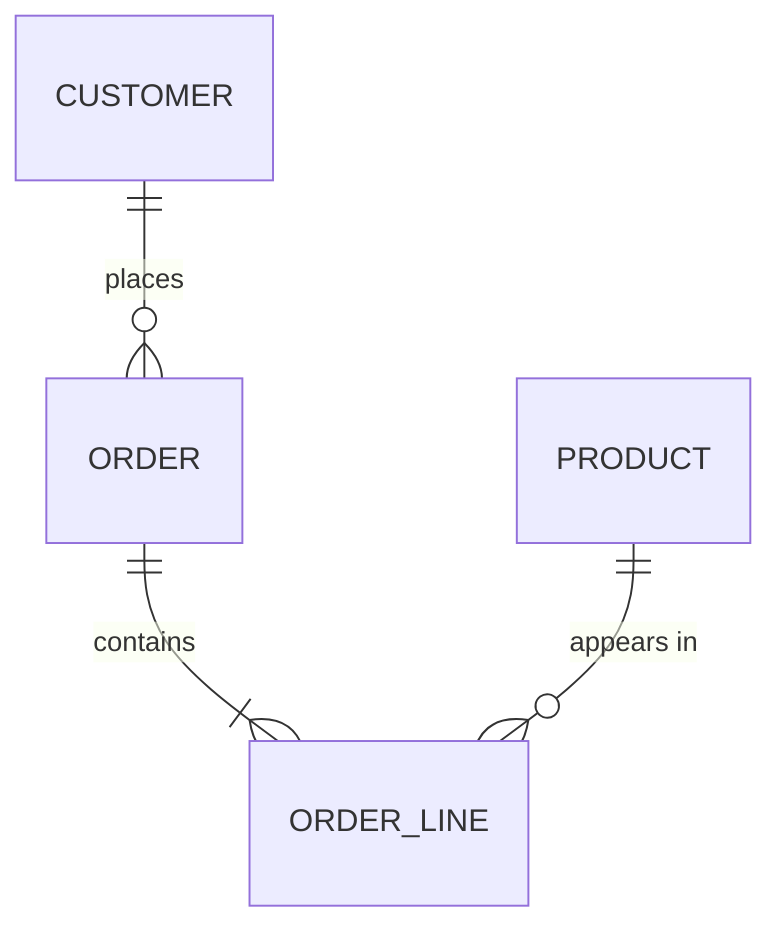

# Data Modeling

The stage between the use-case spec and the SQL. `dbt-model-design` decides how a dbt
model is *built*; this skill decides what the models *are* — the entities, their keys,
their relationships, and their grains.

Skipping this is why projects end up with `fct_orders`, `fct_orders_v2`, and
`fct_orders_final`, each with a different definition of a customer.

## When you need this and when you don't

| Situation | Do this |
|---|---|
| One model on one source, obvious grain | Skip. Go straight to `dbt-model-design`. |
| New subject area, several models | Full canvas → bus matrix → star schema spec |
| A second business process joins an existing one | Bus matrix row only — check the dimensions conform |
| Two teams disagree on an entity definition | Conceptual model only. This is a definition problem, not a SQL problem. |
| Migrating a legacy warehouse | Reverse-engineer the logical model first, then redesign |

## The three levels

Do them in order. Each one answers a question the next one depends on.

| Level | Question | Artifact | Warehouse-specific? |
|---|---|---|---|
| **Conceptual** | What things exist, and how do they relate? | entity list + ERD | no |
| **Logical** | What attributes, keys, cardinalities, and grains? | attribute catalog + grain matrix | no |
| **Physical** | What tables, types, materializations, partitions? | dbt models | yes |

Write the conceptual and logical levels into
[templates/data-model-canvas.md](../../../templates/data-model-canvas.md). The physical
level is the dbt project itself — do not maintain a separate document for it, it will
drift within a month.

### 1. Conceptual — entity discovery

Read the use-case spec and pull out every **noun the business names**. Then filter:

- **Entity** — has an independent identity and a lifecycle. `Customer`, `Vehicle`, `Order`.
- **Attribute** — describes an entity, has no identity of its own. `email`, `mileage`.
- **Relationship** — a verb between entities. `Customer *places* Order`.
- **Event** — something that happened at a point in time. `Order placed`, `Price quoted`.
  Events become facts; entities become dimensions.

Two tests for whether something is a real entity:

1. **Can it exist before and after the relationship?** A `Vehicle` exists before it is
   listed and after it sells. A `ListingLine` does not — it is part of a listing.
2. **Does the business ask questions about it directly?** If nobody ever says "show me
   by X", X is an attribute, not a dimension.

Draw it as a Mermaid ER diagram — this is the artifact that surfaces disagreement fastest,
because people who nod along to prose will argue about an arrow:



Cardinality notation, which you must be explicit about:

| Symbol | Means |
|---|---|
| `||--||` | exactly one to exactly one |
| `||--o{` | one to zero-or-many |
| `||--|{` | one to one-or-many |
| `}o--o{` | many to many — **always** resolves to a bridge table |

The `o` vs `|` on the inner side is **optionality**, and it is the part people skip. "An
order has one customer" — always? Guest checkout says no. That `o` is the difference
between an `inner join` that silently drops 3% of orders and a `left join` with a
documented unknown member.

### 2. Logical — keys, attributes, grain

For each entity, fill in:

**Business (natural) key** — how the business identifies it. `vin`, `order_number`,
`email`. May be composite. May be unstable — record which.

**Surrogate key** — the key your models actually join on, when the business key is
composite, unstable, or wide. Hash only the columns that define the grain:

```sql
{{ dbt_utils.generate_surrogate_key(['vin', 'valuation_date']) }} as vehicle_valuation_sk
```

| Choose | When |
|---|---|
| Business key as PK | Single column, stable, not PII, reasonable width |
| Hashed surrogate | Composite grain, or the business key is wide/unstable |
| Sequence/identity | Almost never in a warehouse — not reproducible across a `--full-refresh` |

**Never** hash a mutable attribute into a key. When the attribute changes, the key
changes, every downstream join breaks, and no test catches it because both sides are
internally consistent.

**Grain, one sentence per entity.** "One row per `<entity>` per `<period>` per
`<qualifier>`." Record the grain of the *source* too — a source at a finer grain than
your model is the fan-out you will hit later.

### 3. Physical — hand off

Once the canvas is filled, each row becomes a
[model blueprint](../../../templates/model-blueprint.md), and `dbt-model-design` takes
over. The canvas outlives individual models; the blueprints do not.

## Normalization — how much

Normalization is a spectrum, not a religion. What matters is **where** you sit at each
layer:

| Layer | Normal form | Why |
|---|---|---|
| Sources | whatever the source system does | not your decision |
| Staging | same shape as the source, cleaned | 1:1 with the source table, so a source change is one file |
| Intermediate | normalized enough to express logic once | this is where the joins live |
| Marts | deliberately denormalized — star schema | consumers join badly and query cost beats storage cost |

The three normal forms in one line each, because you still need them for staging and
intermediate:

- **1NF** — one value per cell. A comma-separated `tags` column violates it. Unnest it.
- **2NF** — no partial dependency on part of a composite key. If `order_line` carries
  `customer_name`, it depends on `order_id` only, not the full key.
- **3NF** — no transitive dependency. `order.customer_city` depends on `customer_id`,
  not on `order_id`. It belongs in the customer dimension.

In a **mart** you break 3NF on purpose: `fct_orders` carries `customer_country` so a
dashboard need not join. That is denormalization, and it is only correct if the value is
the one that was true **at the grain of the fact** — which is exactly the SCD question
below.

## The bus matrix

The single most useful artifact in the whole scaffold, and the cheapest. Business
processes down the side, dimensions across the top, an `X` where the process is measured
by that dimension:

|  | Date | Customer | Vehicle | Dealer | Channel |
|---|---|---|---|---|---|
| Listing created | X | | X | X | X |
| Valuation issued | X | X | X | | |
| Sale completed | X | X | X | X | X |

What it buys you:

- **Conformed dimensions.** A dimension used by two processes must have **one** definition
  and one key. Two `dim_vehicle` tables with different keys means you can never compare
  listings to sales — this is the failure the matrix exists to prevent.
- **Build order.** Build the process with the most X's first; its dimensions are reused.
- **Scope honesty.** A process with one X is not a star schema, it is a report.

Fill in [templates/bus-matrix.md](../../../templates/bus-matrix.md) once per subject
area, not once per model.

## Fact and dimension types

Full detail in
[references/dimensional_modeling.md](../../../references/dimensional_modeling.md). The
choice you have to make here:

**Which kind of fact:**

| Type | Grain | Grows by | Use when |
|---|---|---|---|
| Transaction | one row per event | event volume | something happened at a point in time |
| Periodic snapshot | one row per entity per period | entities × periods | you need state at regular intervals (balances, inventory) |
| Accumulating snapshot | one row per entity, milestone columns | entity count | a pipeline with known stages — you update rows in place |
| Factless | one row per event, no measures | event volume | coverage/eligibility, or counting occurrences |

**Which kind of dimension:**

| Type | Use when |
|---|---|
| Conformed | shared across processes — the default target |
| Degenerate | a transaction identifier with no attributes; keep it **on the fact** |
| Junk | several low-cardinality flags collapsed into one small dimension |
| Role-playing | one date dimension referenced as `ordered_date`, `shipped_date` |
| Mini-dimension | rapidly changing attributes split out to stop SCD2 explosion |
| Outrigger | a dimension referenced by another dimension — use sparingly, it is a snowflake |
| Bridge | resolves many-to-many; carries an allocation factor when weights matter |

**Additivity** — record it per measure, because it decides what a BI tool is allowed to do:

| Additivity | Summable across | Example |
|---|---|---|
| Additive | every dimension | `sale_amount` |
| Semi-additive | every dimension **except time** | `account_balance`, `inventory_on_hand` |
| Non-additive | nothing — must be recomputed from components | `margin_pct`, `avg_price` |

A semi-additive measure summed across time is the classic silently-wrong dashboard. Put
the additivity in the column description, and define the measure in the semantic layer
so the aggregation is not the BI tool's decision.

## Slowly changing dimensions

The question is always: **when a fact points at a dimension row, do you want the
attribute as it is now, or as it was then?**

| Type | Behavior | Cost | Use when |
|---|---|---|---|
| **0** | never changes | none | true constants — birth date, VIN |
| **1** | overwrite | none | corrections; history has no business meaning |
| **2** | new row per change, `valid_from`/`valid_to`/`is_current` | table grows; every join needs a date predicate | the default when history matters |
| **3** | `current_x` + `previous_x` columns | fixed; only one step of history | "compare to prior segment" and nothing more |
| **4** | current in the dim, history in a separate table | two objects to keep in sync | mixed access patterns |
| **6** | Type 1 + 2 + 3 combined — SCD2 rows also carrying a current value | most complex | you genuinely need both "as was" and "as is" in one query |

On dbt Core, **Type 2 is a `snapshot`, not a model**:

```yaml
snapshots:
  - name: vehicles_snapshot
    relation: source('inventory', 'vehicles')
    config:
      unique_key: vehicle_id
      strategy: check
      check_cols: [trim_level, condition_grade, list_price]
```

Snapshot the **raw source**, never a transformed model — a logic change would rewrite
history. And never change a snapshot's `unique_key` or `strategy` after the first run:
the existing rows cannot be recovered, and no error tells you.

Detail and the query patterns are in
[incremental-and-snapshots](../incremental-and-snapshots/SKILL.md).

## Choosing a paradigm

Full comparison in
[references/data_modeling_paradigms.md](../../../references/data_modeling_paradigms.md).
The short version:

| Paradigm | Pick it when | Real cost |
|---|---|---|
| **Kimball star** | BI and analytics consumers, business-process questions | fan-out discipline is on you |
| **Inmon / 3NF core** | many downstream systems, heavy compliance, one integrated store | slow to deliver; needs a mart layer anyway |
| **Data Vault 2.0** | many volatile sources, auditability is a legal requirement | 3-5x the object count; unusable without a mart layer on top |
| **One Big Table** | one consumer that joins badly, or ML feature serving | every upstream change touches it; easy to fan out silently |
| **Activity Schema** | product/behavioral analytics, entity streams | poor fit for finance and anything reconciled |
| **Medallion** | a naming convention, not a model | bronze/silver/gold ≈ staging/intermediate/marts — it tells you nothing about grain |

**Default to Kimball marts on top of dbt's staging/intermediate layers.** Everything else
is a response to a constraint you should be able to name. If you cannot name it, you do
not have it.

## Working the model

1. **Read the use-case spec.** No canvas without a spec — rule 1.
2. **List entities and events.** Nouns and verbs from the spec, filtered by the two tests.
3. **Draw the ERD** with explicit cardinality *and optionality*. Review it with the
   requester. This is where you find out that "customer" means account to finance and
   person to marketing.
4. **Fill the canvas** — keys, attributes, grain, SCD type, source of truth per attribute.
5. **Fill the bus matrix** if there is more than one business process.
6. **Write the star schema spec** per process: the fact, its grain, its dimension keys,
   its measures and their additivity.
7. **Hand off** to `dbt-model-design`, one model blueprint per table.
8. **Validate against the built project** once models exist:

```bash
python scripts/erd_generator.py --manifest target/manifest.json --layer marts --out erd.md
python scripts/dimensional_model_validator.py --manifest target/manifest.json --strict
```

## Anti-patterns

- **Modeling the source system.** If your ERD looks like the Shopify schema, you have
  copied a transactional design into an analytical warehouse. Entities are business
  concepts, not tables.
- **A dimension nobody slices by.** If no question starts "by X", X is an attribute on a
  fact, not a dimension. Every dimension costs a join forever.
- **Skipping optionality.** `||--||` where reality is `||--o{` is a mandatory join to
  incomplete data — rows vanish and nobody notices for a quarter.
- **SCD2 on everything.** A dimension where three columns change daily and forty are
  static explodes. Split the volatile columns into a mini-dimension.
- **A surrogate key hashed from a mutable attribute.** Silent join breakage on the day
  someone fixes a typo upstream.
- **Two "conformed" dimensions with different keys.** Not conformed. The bus matrix
  exists to catch this before both are built.
- **Denormalizing an attribute into a fact without deciding as-was vs as-is.** Both are
  defensible; not choosing is not. `dimensional_model_validator.py` flags these as
  `denormalized_attribute` so the decision is at least recorded.
- **An aggregate belonging to another entity, sitting on a fact.** `dealer_total_inventory`
  on a valuation-grain fact is summed once per valuation. Every test passes.
- **A conceptual model maintained after go-live.** The canvas records decisions and open
  questions. The dbt project is the physical truth — do not keep a second one.
- **Bridge tables without an allocation factor** where the business expects allocated
  totals. Summing across a bridge double-counts by design.

## Examples

How this gets called in Claude Code, and what it should hand back.

| Ask Claude | What you get |
|---|---|
| `/data-model subscriptions` | Entities, ERD with cardinality *and* optionality, keys, grain, and the bus matrix row |
| "star schema or one big table?" | A recommendation tied to this subject area, not a general comparison |
| "marketing and finance disagree on what a customer is" | The conformed-dimension answer: one key, one definition, one table, one shared domain |
| "how do we track price changes?" | The SCD decision made explicitly — and why Type 2 means a snapshot on the raw source |

**Worked example**

> `/data-model subscription revenue`

```
Entities (nouns that pass both tests)
  customer, subscription, plan, invoice          — dimensions and one event
  invoice_issued                                 — the business process

ERD — optionality is the part people skip
  customer ||--o{ subscription   a customer may have zero subscriptions
  plan     ||--o{ subscription   every subscription has exactly one plan
  subscription ||--o{ invoice    a subscription may have zero invoices (trials)
  → the customer→subscription join is LEFT; an inner join drops trial-only customers.

Keys
  business  : subscription_id (Stripe, stable)
  surrogate : generate_surrogate_key(['subscription_id','invoice_month'])
              hashes exactly the grain columns — never plan_name, which changes.

Grain
  fct_subscription_revenue: one row per subscription per month.

Measures and additivity
  mrr_amount        semi-additive  — additive across subscriptions, NOT across months
  discount_pct      non-additive   — store numerator and denominator; define as a metric

SCD
  dim_plan  Type 2 — price changes must not restate historical revenue.
            → snapshot on the raw source; unique_key and strategy are permanent.
  dim_customer Type 1 — nobody has asked for historical addresses.

Bus matrix
                     customer  plan  subscription  date
  invoice_issued        X       X         X         X
  trial_started         X       X         X         X
  → customer and plan are conformed. Both stars must share the same keys.
```

```bash
# Once the models exist, validate the physical against the design
python scripts/erd_generator.py --manifest target/manifest.json --layer marts --out erd.md
python scripts/dimensional_model_validator.py --manifest target/manifest.json --strict
```

Hand off to [dbt-model-design](../dbt-model-design/SKILL.md), one blueprint per table. The
canvas is a decision record, not a second source of truth — the dbt project is physical
truth once it exists.
