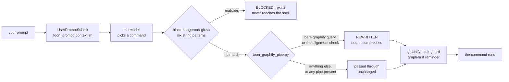
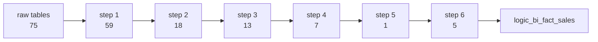

<Badge variant="accent">Measured</Badge> <Badge variant="default">No model in the loop</Badge>

When a prompt arrives, most of what happens next is **not the model deciding**. A short chain of small programs reads the command the model intends to run and passes it, edits it, or stops it — before the command reaches the shell. Everything below is measured from this repository, not illustrative.



Each box is a real file registered in `.claude/settings.json`, and every verdict is decided by plain text matching. No model is consulted at any point in that chain.

## Four requests, four outcomes

<Tabs param="request">
  <Tab title="A question">
    `"Where does the TOON serializer get used?"` — the model reaches for the graph, and the command it asked for is not the command that runs.

    | Checkpoint | Verdict | Why |
    |---|---|---|
    | `toon_prompt_context.sh` | pass | One sentence stapled to every prompt, unconditionally |
    | `block-dangerous-git.sh` | pass | Starts with `graphify`; none of the six patterns match |
    | `toon_graphify_pipe.py` | **rewrite** | Bare `graphify query`, serializer present, no pipe to break |
    | `graphify hook-guard` | pass | Injects the graph-first reminder |

    ```bash Terminal
    # what the model asked for
    graphify query "how does the TOON serializer connect to the graphify hook"

    # what actually ran
    graphify query "..." | rust/toon/bin/graph_to_toon --passthrough
    ```

    The result: 176 nodes found, 11 returned inside a 400-token budget, **1,375 characters** of TOON instead of 1,701 of prose. The model is never told its command was edited.
  </Tab>

  <Tab title="A push">
    `"Push my branch when you're done."` — refused at the second checkpoint, before anything executes.

    ```bash Terminal
    git push origin main
    # BLOCKED: dangerous git command is not allowed by repository guardrails
    # exit 2 — no network call, no branch moved, no remote touched
    ```

    The guardrail evaluates no intent and reads no context. It matches the start of the command against six patterns — `push`, `reset --hard`, `clean -f`, `branch -D`, `checkout .`, `restore .` — and exits. The model sees the refusal and must choose a different approach; it cannot retry its way past a checkpoint.
  </Tab>

  <Tab title="A shell one-liner">
    `"How many analysis scripts are there?"` — passed through untouched, on purpose.

    ```bash Terminal
    ls scripts/*.py | wc -l
    ```

    The rewriter **declines** any command containing `|`, `;`, `&`, `<`, or `>`. Rewriting a command that already redirects its own output risks changing what it means, so a composed command is left completely alone. Restraint here is what makes the rewrite safe everywhere else.
  </Tab>

  <Tab title="/new-connector favrit">
    One prompt, six shell commands, three different verdicts — and the last one refused.

    ```bash Terminal
    /new-connector favrit --use-case enhanza-analytics
    ```

    | # | Command | Verdict |
    |---|---|---|
    | 1 | slash command loads the `connector-onboarding` skill | *no gate* — nothing executed yet |
    | 2 | `ls skill-packs/*/use-cases/` | pass |
    | 3 | `python3 scripts/new_connector.py favrit --dry-run` | pass |
    | 4 | `python3 scripts/connector_alignment_check.py --check` | **rewrite** |
    | 5 | `git switch -c feat/ENH-1-favrit-connector` | pass |
    | 6 | `git push -u origin HEAD` | **BLOCKED** |

    Step 1 touches no checkpoint at all — a slash command is a markdown file describing how to work, and the checkpoints only wake up once the model reaches for the shell.

    Step 3 prints the conventions it inferred from the project's busiest existing connector rather than assuming them, and refuses to write the connector's contract for you:

    ```text
    Detected conventions, from 'fortnox'
      staging model    favrit_bi_<model>_staging
      adapter model    favrit_erp_bi_<concept>
      source name      favrit_api
      enable var       is_favrit_enabled

    Would create 2 file(s)
    Left alone, already present (3)
    ```

    `sources.yml`, the registry, and `dbt_project.yml` are printed to paste by hand, so a reviewer sees the contract as a human diff rather than as generated text.

    Step 4 is the only repository script on the compression list, because its findings are a uniform record list — measured elsewhere at 7,447 characters down to 2,624. The rewriter prepends `set -o pipefail`; without it a failing `--check` would report the compressor's exit code and a red gate would go silently green.

    Step 6 is refused even though the command file itself says *push only when asked*. That sentence is a document the model could ignore; the checkpoint is not, and it does not care that five commands already succeeded.
  </Tab>
</Tabs>

:::note[The safety property, stated plainly]
It does not rest on the model choosing well. It rests on six string patterns in a 38-line shell script that runs **before** the model's command reaches the computer.
:::

## What the model actually sees

A graph query is not handed over whole. The question's words are matched to starting nodes, the search walks outward exactly two steps, and the result is then **cut to fit a token budget**, keeping the best-connected nodes. Measured on one real question that reaches 176 nodes:

| `--budget` | nodes kept | characters returned |
|---|---|---|
| 200 | 6 of 176 | 1,196 |
| 400 | 11 of 176 | 1,701 |
| 800 | 22 of 176 | 2,946 |
| 1,500 | 41 of 176 | 4,984 |
| 3,000 | 80 of 176 | 9,505 |
| 6,000 | 153 of 176 | 18,467 |

This is why a vague question gets a vague answer: at a 400-token budget the search finds 176 relevant things and shows eleven. The fix is a narrower question, not a bigger model.

## One number, and everything holding it up

`graphify` maps code; it has no SQL parser, so dbt models enter the code graph as isolated file nodes. The lineage comes from dbt's own build manifest instead — every edge compiled, none inferred. Tracing one finished figure in the worked use-case:



That single figure stands on **178 other tables through 231 computed links, seven steps deep**, starting from 75 raw source tables across twelve connectors — of which one, `fortnox`, accounts for 170 of the project's <b data-metric="dbt_models">379</b> models. Every block to the left of the figure has to be correct, on time, and unchanged in shape for the number to be right.

:::warning[Never run `graphify update` after a dbt merge]
A rebuild deletes all <b data-metric="dbt_models">379</b> models and their <b data-metric="dbt_edges">1336</b> edges, because there is no SQL parser to re-extract them from — and leaves a graph that still looks populated. This is not hypothetical: it happened in this checkout, and the measurement taken at the time was 104 of 688 lineage links surviving. Re-running `--merge` restored all 688 and dropped isolated nodes from 353 to 94. Rebuild **before** the merge, never after.
:::

## See it move

The interactive version renders the same data as live diagrams — a clickable map of the code neighbourhoods, the two-step search with a draggable budget, and a lineage tracer that lights up every table feeding a chosen figure.

<iframe
  src="/decision-path.html"
  title="The Decision Path — how code-skills answers a prompt"
  width="100%"
  height="900"
  loading="lazy"
></iframe>

:::tip[If the frame is blank]
The page is committed at `public/decision-path.html`, which serves at `/decision-path.html` under Astro's static-asset convention. If Blume publishes assets from a different root, adjust the `src` above — the file is entirely self-contained, with no external requests, so it works from any path that serves it.
:::

:::note[Which figures are pinned, and which are snapshots]
Every figure on the embedded page that comes from a **committed** artifact — the model, source, seed and lineage-edge counts, and the per-connector totals — is checked against `artifacts/graphify-fragment.json` by `tests/test_decision_path_page.py`. Figures that need a rebuild, chiefly the size of the code graph, are **not** pinned: a gate that goes red because somebody ran `graphify update` is a gate that gets switched off. Those are labelled as snapshots and the page footer names the command that re-derives each.
:::
