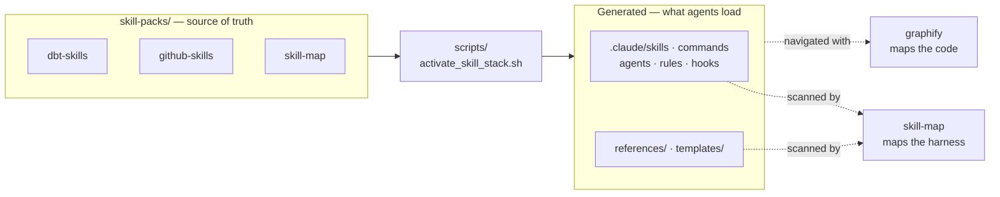
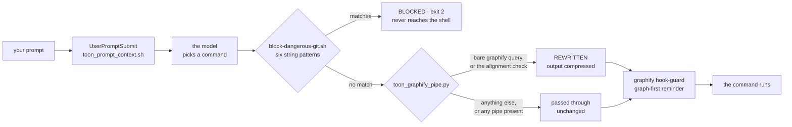
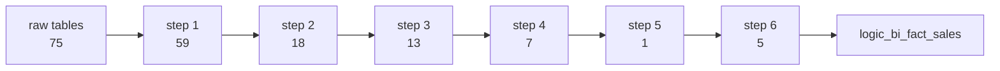

<Badge variant="accent">dbt Core</Badge> <Badge variant="default">Git workflow</Badge> <Badge variant="success">No API key required</Badge>

**Code Skills** is a self-contained module you drop into another repository as a submodule. It ships the skills, slash commands, agents, and static analyzers that turn three separate disciplines — shipping code, shipping data models, and maintaining the AI harness itself — into one reviewable workflow.

Everything here runs from a checkout and a Python interpreter. No warehouse connection, no dbt Cloud account, no model API key.

## Three domains, one module

<CardGroup cols={3}>
  <Card title="Git workflow automation" icon="git-branch" href="/skills-inventory#github--git-skills">
    Conventional commits, branch planning, PR review ceremonies, and guardrail hooks that refuse dangerous operations before they run.
  </Card>
  <Card title="dbt Core analytics engineering" icon="database" href="/skills-inventory#dbt-skills">
    A senior analytics engineer's full method — use-case spec, grain, layers, contracts, tests, semantic layer — plus eleven artifact-driven analyzers.
  </Card>
  <Card title="Harness cartography" icon="map" href="/skills-inventory#harness--repository-maintenance">
    `skill-map` scans the harness itself for name collisions, dead references, and reserved-name shadowing. Deterministic, no LLM.
  </Card>
</CardGroup>

## How the pieces fit

Skill packs are the source of truth. Activation materialises them into the paths agents actually load, and two independent graphs keep the result honest — one over the code, one over the harness.



:::warning[Edit the pack, never the mirror]
`.claude/`, `references/`, and `templates/` are **generated output**. A direct edit there is silently reverted the next time `./scripts/activate_skill_stack.sh` runs. Change the file under `skill-packs/<pack>/`, re-activate, and commit both.
:::

## Quick start

<Steps>
  <Step title="Set up the environment">
    Clone the repository and run the suite. A clean run means the scaffold, the hooks, and the analyzers all agree.

    ```bash Terminal
    python3 -m venv .venv
    source .venv/bin/activate
    pytest -q
    ```
  </Step>

  <Step title="Activate a skill stack">
    Activation copies a pack into the live `.claude/` tree. It is idempotent — a clean `git status` afterwards is the check that nothing drifted.

    ```bash Terminal
    ./scripts/activate_skill_stack.sh dbt-skills
    git status --short
    ```
  </Step>

  <Step title="Pick your first path">
    <Tabs param="path">
      <Tab title="dbt Core">
        Run the self-contained worked example on DuckDB. No cloud warehouse account needed.

        ```bash Terminal
        .venv/bin/pip install 'dbt-core~=1.9.0' 'dbt-duckdb~=1.9.0'
        cd skill-packs/dbt-skills/use-cases/example-order-revenue-mart/dbt_project
        ./run_local.sh
        ```
      </Tab>
      <Tab title="Git workflow">
        Start from the intent index — it maps what you want to do onto the command that does it.

        ```bash Terminal
        /skills-index
        /branch-plan
        /review
        ```
      </Tab>
      <Tab title="Harness map">
        Audit the harness for structural defects. Deterministic, and safe to wire into CI.

        ```bash Terminal
        python scripts/skill_map_scan.py --summary
        python scripts/skill_map_scan.py --check --max-errors 1
        ```
      </Tab>
    </Tabs>
  </Step>
</Steps>

:::tip[Start with `/skills-index`]
Capabilities are organised by **intent**, not by filename. `/skills-index` is the fastest way to find the command for the task in front of you across all 38 skills.
:::

## What you get

<CardGroup cols={2}>
  <Card title="Static analysis suite" icon="search" href="/SKILL#tools">
    Eleven standard-library Python analyzers that read dbt's JSON artifacts — project health, lineage and blast radius, test coverage, contract breaks, ERDs. None of them touch the warehouse.
  </Card>
  <Card title="Modular skill packs" icon="package">
    Three portable packs, each with its own `.claude-plugin/plugin.json`, so a pack can be adopted on its own and portability is checked in CI.
  </Card>
  <Card title="Guardrails that hold" icon="shield-check">
    PreToolUse hooks block dangerous git operations, enforce graph-first navigation, and pin the token pipeline. Enforcement is registered, not remembered.
  </Card>
  <Card title="Token-aware AI context" icon="brain" href="/docs/INTEGRATIONS">
    RTK filters command output, Graphify replaces file-reading with graph queries, and TOON serialises uniform record lists at a fraction of JSON's token cost.
  </Card>
</CardGroup>

## Two graphs, two purposes

Neither substitutes for the other, and conflating them is the most common mistake when adopting this module.

<Columns cols={2}>
  <Column>
    ### `graphify` — the code

    Answers structural questions about the application: what calls this, what breaks if I change it, where does this concept live.

    ```bash
    graphify query "how does activation work"
    graphify path "GraphManager" "toon-serializer"
    ```

    Traversal is fixed at BFS depth 2. `--budget N` is the lever; `--depth` is accepted and silently ignored.
  </Column>
  <Column>
    ### `skill-map` — the harness

    Answers questions about the agent surface: which skills collide, which references are dead, which names the runtime shadows.

    ```bash
    python scripts/skill_map_scan.py --summary
    ```

    Every finding is **doubled** — pack and mirror are both scanned. A finding in only one tree is drift, and a different problem.
  </Column>
</Columns>

<Panel title="Why the harness scan needs no model">
  skill-map upstream ships a deterministic scanner *and* a probabilistic layer that queues LLM jobs. Only the first is wired in. Every invocation goes through `_run_sm()` in `scripts/skill_map_scan.py`, which **raises** on all four probabilistic verb families — `jobs`, `agent`, `findings`, `refresh` — and `tests/test_skill_map_pack.py` pins that allowlist independently, so weakening the wrapper fails the suite rather than quietly changing what CI depends on.

  Where Node is absent the runner exits `3` and the caller records a `skip`. A repository check never goes red for a missing optional toolchain.
</Panel>

## The decision path

When a prompt arrives, most of what happens next is **not the model deciding**. A short chain of small programs reads the command the model intends to run and passes it, edits it, or stops it — before the command reaches the shell. Everything below is measured from this repository, not illustrative.



Each box is a real file registered in `.claude/settings.json`, and every verdict is decided by plain text matching. No model is consulted at any point in that chain.

### Four requests, four outcomes

<Tabs param="request">
  <Tab title="A question">
    `"Where does the TOON serializer get used?"` — the model reaches for the graph, and the command it asked for is not the command that runs.

    | Checkpoint | Verdict | Why |
    |---|---|---|
    | `toon_prompt_context.sh` | pass | One sentence stapled to every prompt, unconditionally |
    | `block-dangerous-git.sh` | pass | Starts with `graphify`; none of the six patterns match |
    | `toon_graphify_pipe.py` | **rewrite** | Bare `graphify query`, serializer present, no pipe to break |
    | `graphify hook-guard` | pass | Injects the graph-first reminder |

    ```bash Terminal
    # what the model asked for
    graphify query "how does the TOON serializer connect to the graphify hook"

    # what actually ran
    graphify query "..." | rust/toon/bin/graph_to_toon --passthrough
    ```

    The result: 176 nodes found, 11 returned inside a 400-token budget, **1,375 characters** of TOON instead of 1,701 of prose. The model is never told its command was edited.
  </Tab>

  <Tab title="A push">
    `"Push my branch when you're done."` — refused at the second checkpoint, before anything executes.

    ```bash Terminal
    git push origin main
    # BLOCKED: dangerous git command is not allowed by repository guardrails
    # exit 2 — no network call, no branch moved, no remote touched
    ```

    The guardrail evaluates no intent and reads no context. It matches the start of the command against six patterns — `push`, `reset --hard`, `clean -f`, `branch -D`, `checkout .`, `restore .` — and exits. The model sees the refusal and must choose a different approach; it cannot retry its way past a checkpoint.
  </Tab>

  <Tab title="A shell one-liner">
    `"How many analysis scripts are there?"` — passed through untouched, on purpose.

    ```bash Terminal
    ls scripts/*.py | wc -l
    ```

    The rewriter **declines** any command containing `|`, `;`, `&`, `<`, or `>`. Rewriting a command that already redirects its own output risks changing what it means, so a composed command is left completely alone. Restraint here is what makes the rewrite safe everywhere else.
  </Tab>

  <Tab title="/new-connector favrit">
    One prompt, six shell commands, three different verdicts — and the last one refused.

    ```bash Terminal
    /new-connector favrit --use-case enhanza-analytics
    ```

    | # | Command | Verdict |
    |---|---|---|
    | 1 | slash command loads the `connector-onboarding` skill | *no gate* — nothing executed yet |
    | 2 | `ls skill-packs/*/use-cases/` | pass |
    | 3 | `python3 scripts/new_connector.py favrit --dry-run` | pass |
    | 4 | `python3 scripts/connector_alignment_check.py --check` | **rewrite** |
    | 5 | `git switch -c feat/ENH-1-favrit-connector` | pass |
    | 6 | `git push -u origin HEAD` | **BLOCKED** |

    Step 1 touches no checkpoint at all — a slash command is a markdown file describing how to work, and the checkpoints only wake up once the model reaches for the shell.

    Step 3 prints the conventions it inferred from the project's busiest existing connector rather than assuming them, and refuses to write the connector's contract for you:

    ```text
    Detected conventions, from 'fortnox'
      staging model    favrit_bi_<model>_staging
      adapter model    favrit_erp_bi_<concept>
      source name      favrit_api
      enable var       is_favrit_enabled

    Would create 2 file(s)
    Left alone, already present (3)
    ```

    `sources.yml`, the registry, and `dbt_project.yml` are printed to paste by hand, so a reviewer sees the contract as a human diff rather than as generated text.

    Step 4 is the only repository script on the compression list, because its findings are a uniform record list — measured elsewhere at 7,447 characters down to 2,624. The rewriter prepends `set -o pipefail`; without it a failing `--check` would report the compressor's exit code and a red gate would go silently green.

    Step 6 is refused even though the command file itself says *push only when asked*. That sentence is a document the model could ignore; the checkpoint is not, and it does not care that five commands already succeeded.
  </Tab>
</Tabs>

:::note[The safety property, stated plainly]
It does not rest on the model choosing well. It rests on six string patterns in a 38-line shell script that runs **before** the model's command reaches the computer.
:::

### What the model actually sees

A graph query is not handed over whole. The question's words are matched to starting nodes, the search walks outward exactly two steps, and the result is then **cut to fit a token budget**, keeping the best-connected nodes. Measured on one real question that reaches 176 nodes:

| `--budget` | nodes kept | characters returned |
|---|---|---|
| 200 | 6 of 176 | 1,196 |
| 400 | 11 of 176 | 1,701 |
| 800 | 22 of 176 | 2,946 |
| 1,500 | 41 of 176 | 4,984 |
| 3,000 | 80 of 176 | 9,505 |
| 6,000 | 153 of 176 | 18,467 |

This is why a vague question gets a vague answer: at a 400-token budget the search finds 176 relevant things and shows eleven. The fix is a narrower question, not a bigger model.

### One number, and everything holding it up

`graphify` maps code; it has no SQL parser, so dbt models enter the code graph as isolated file nodes. The lineage comes from dbt's own build manifest instead — every edge compiled, none inferred. Tracing one finished figure in the worked use-case:



That single figure stands on **178 other tables through 231 computed links, seven steps deep**, starting from 75 raw source tables across eleven connectors — of which one, `fortnox`, accounts for 170 of the project's 359 models. Every block to the left of the figure has to be correct, on time, and unchanged in shape for the number to be right.

:::warning[Never run `graphify update` after a dbt merge]
A rebuild deletes all 359 models and their 1,288 edges, because there is no SQL parser to re-extract them from — and leaves a graph that still looks populated. This is not hypothetical: it happened in this checkout, leaving 104 of 688 lineage links. Re-running `--merge` restored all 688 and dropped isolated nodes from 353 to 94. Rebuild **before** the merge, never after.
:::

### See it move

The interactive version renders the same data as live diagrams — a clickable map of the 248 code neighbourhoods, the two-step search with a draggable budget, and a lineage tracer that lights up every table feeding a chosen figure.

<iframe
  src="/decision-path.html"
  title="The Decision Path — how code-skills answers a prompt"
  width="100%"
  height="900"
  loading="lazy"
></iframe>

:::tip[If the frame is blank]
The page is committed at `public/decision-path.html`, which serves at `/decision-path.html` under Astro's static-asset convention. If Blume publishes assets from a different root, adjust the `src` above — the file is entirely self-contained, with no external requests, so it works from any path that serves it.
:::

## Repository layout

Only the first branch is hand-written. Everything under `.claude/`, `references/`, and `templates/` is produced by activation.

<FileTree>
- skill-packs/
  - dbt-skills/
  - github-skills/
  - skill-map/
- .claude/
  - skills/
  - commands/
  - agents/
  - rules/
  - hooks/
- scripts/
  - activate_skill_stack.sh
  - skill_map_scan.py
- references/
- templates/
- tests/
</FileTree>

| Path | Role | Editable |
|---|---|---|
| `skill-packs/<pack>/` | Source of truth for every skill, command, agent, and rule | Yes |
| `.claude/` | The tree agents actually load, materialised by activation | No — generated |
| `references/`, `templates/` | Shared assets, mirrored so one relative path resolves in both trees | No — generated |
| `scripts/` | Analyzers, activation, and the CI gates | Yes |
| `tests/` | 13 suites pinning the contracts on this page | Yes |

## Non-negotiables

These are enforced by tests and hooks, not by convention. Each one exists because its absence has a specific, silent failure mode.

<Accordion>
  <AccordionItem title="No model before a use-case spec" icon="file-text">
    Every dbt engagement starts by writing `use-case-spec.md`. A request that sounds well specified almost always still has an undefined grain or an unnamed consumer — and both surface as a rebuild later.
  </AccordionItem>
  <AccordionItem title="Declare the grain before writing SQL" icon="ruler">
    One sentence: "one row per `<entity>` per `<period>`". Every downstream ambiguity traces back to a grain nobody wrote down, and a measure that is true at a coarser grain double-counts, passes every test, and produces a dashboard that looks correct.
  </AccordionItem>
  <AccordionItem title="`dbt build`, never `run` then `test`" icon="play">
    `build` runs each model's tests immediately after that model and stops its dependents on failure. Running all models and then all tests propagates bad data through the entire DAG before anything fails.
  </AccordionItem>
  <AccordionItem title="Only `source()` and `ref()`" icon="link">
    No model selects from a hardcoded `database.schema.table`. These two functions are what make lineage, `--select`, and state comparison work at all.
  </AccordionItem>
  <AccordionItem title="Never commit directly to `main`" icon="git-branch">
    Branches follow `<type>/<ticket>-<description>` and commits follow Conventional Commits. `.claude/hooks/block-dangerous-git.sh` blocks `push`, `reset --hard`, `clean -fd`, and friends at the tool boundary.
  </AccordionItem>
</Accordion>

The complete list lives in [the analytics engineering rules](/CLAUDE) and is loaded into every session.

## Verifying a change

<CodeGroup>
```bash Everything
pytest -q
./scripts/activate_skill_stack.sh dbt-skills && git status --short
./scripts/marketplace_portability_check.sh
```

```bash Harness
python scripts/skill_map_scan.py --check --max-errors 1 --summary
```

```bash dbt
python scripts/dbt_project_auditor.py --manifest target/manifest.json --strict
python scripts/test_coverage_reporter.py --manifest target/manifest.json --layer marts --min-coverage 0.9
```
</CodeGroup>

:::note[Activation must leave a clean tree]
`git status --short` after activation is the drift check CI runs. Unexpected modifications in that output mean an edit landed in a generated path — fix the pack and re-activate rather than committing the mirror.
:::

## Dive deeper

<CardGroup cols={2}>
  <Card title="Skills inventory" icon="list" href="/skills-inventory">
    Every skill, indexed by intent, with syntax and a worked example.
  </Card>
  <Card title="The dbt method" icon="workflow" href="/SKILL">
    The end-to-end analytics engineering workflow, from raw request to deployed mart.
  </Card>
  <Card title="Way of working" icon="compass" href="/docs/WAY_OF_WORKING">
    The delivery contract this module holds itself to.
  </Card>
  <Card title="Integrations" icon="plug" href="/docs/INTEGRATIONS">
    RTK, Graphify, TOON, and AgentMemory — setup and operational commands.
  </Card>
</CardGroup>
