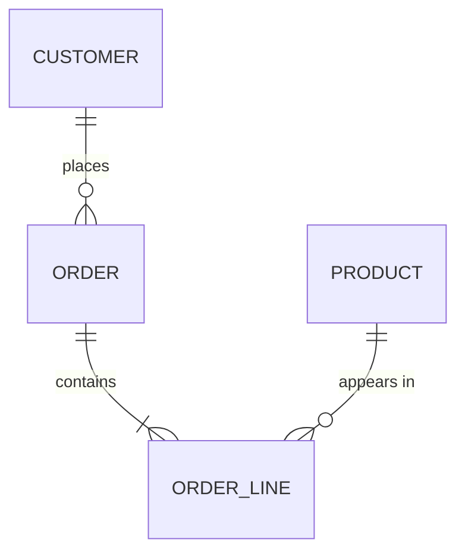

# Data Model Canvas — <subject area>

The conceptual and logical model for a subject area. Written **after** the use-case spec
and **before** any model blueprint. One canvas per subject area, not per model.

The canvas records decisions and open questions. It is not a mirror of the dbt project —
once models exist, the project is the physical truth and this document stops being
updated except when a *decision* changes.

| Field | Value |
|---|---|
| Subject area | |
| Use case(s) | `use-cases/<slug>/use-case-spec.md` |
| Author / owner | |
| Date | |
| Status | draft / reviewed / approved |
| Paradigm | Kimball star / +3NF core / +vault / OBT serving — and the constraint that forced it |

---

## 1. Entities

Nouns with an independent identity and lifecycle. Two tests before something goes in this
table: *can it exist before and after the relationship?* and *does the business ask
questions "by" it?*

| Entity | What it is, in business words | Source of truth | Becomes |
|---|---|---|---|
| | | `<source>.<table>` | `dim_<x>` / `fct_<x>` / bridge / attribute only |

**Rejected candidates** — record these, they come back:

| Candidate | Why it is not an entity |
|---|---|
| | attribute of `<entity>` / no independent lifecycle / nobody slices by it |

## 2. Events (business processes)

Verbs the business performs and measures. Each becomes a fact table.

| Event | Grain — one sentence | Frequency | Becomes |
|---|---|---|---|
| | one row per `<entity>` per `<period>` | | `fct_<process>` |

## 3. ERD

Cardinality **and optionality**. `o` means the relationship is optional on that side —
this is the part that decides `inner` vs `left join`, so do not leave it at the default.

| Relationship | Cardinality | Optional side | What the optionality means in practice |
|---|---|---|---|
| Customer → Order | 1:N | order.customer_id nullable | guest checkout — `left join` + unknown member |

Many-to-many relationships, and how each is resolved:

| Relationship | Bridge table | Allocation factor needed? |
|---|---|---|
| | `bridge_<a>_<b>` | yes / no — and what the business expects totals to do |

## 4. Keys

| Entity | Business key | Stable? | Surrogate key | Why a surrogate |
|---|---|---|---|---|
| | `<column(s)>` | yes / no | `{{ dbt_utils.generate_surrogate_key([...]) }}` | composite grain / unstable BK / wide BK / none needed |

Never hash a mutable attribute into a key. When it changes, every downstream join breaks
and no test catches it.

## 5. Attributes

One block per entity. Enumerate — this is the list that becomes the model's column list
and its `schema.yml`.

### `<entity>`

| Attribute | Type | Source | Nullable | SCD type | Notes |
|---|---|---|---|---|---|
| | | `<source>.<table>.<column>` | | 0 / 1 / 2 / 3 / 6 | PII? derived? banded? |

**Attributes with a contested definition** — the ones two teams answer differently:

| Attribute | Team A says | Team B says | Decision | Decided by |
|---|---|---|---|---|

## 6. Grain matrix

Every table this canvas produces, and what one row means. Reviewers read this first.

| Model | One row per | Primary key | Expected rows (order of magnitude) | Growth |
|---|---|---|---|---|

## 7. History requirements

| Entity/attribute | Does history matter? | Why | SCD type | Mechanism |
|---|---|---|---|---|
| | | audit / trend analysis / as-of reporting / no | 1 / 2 / 3 / 6 | overwrite / `snapshot` / lag column |

Snapshots are on the **raw source**, never on a transformed model. `unique_key`,
`strategy`, and `check_cols` cannot be changed after the first run.

## 8. Additivity

For every measure. This decides what a BI tool is allowed to do with the column, and a
semi-additive measure summed across time is the classic silently-wrong dashboard.

| Measure | Fact | Additive / semi-additive / non-additive | Not summable across | Semantic layer metric |
|---|---|---|---|---|

## 9. Conformance

Dimensions shared by more than one process. Same key, same definition, **one table**.

| Dimension | Used by processes | Single definition agreed? | Owner |
|---|---|---|---|

If a dimension is used by two processes and the key differs, stop — the two stars can
never be compared, which is the failure the bus matrix exists to prevent. See
[bus-matrix.md](bus-matrix.md).

## 10. Open questions

Everything unresolved. Do not invent an answer — mark it and design around it.

| # | Question | Blocks | Owner | Status |
|---|---|---|---|---|
| 1 | `[NEEDS INPUT]` | | | open |

## 11. Decisions log

The decisions worth remembering in six months, when someone asks why.

| Date | Decision | Alternative rejected | Because |
|---|---|---|---|

---

## Review checklist

- [ ] Every entity passed both entity tests; rejected candidates are recorded.
- [ ] Every relationship has explicit cardinality **and** optionality.
- [ ] Every many-to-many resolves to a bridge, with the allocation question answered.
- [ ] Every entity has a key, and no key hashes a mutable attribute.
- [ ] Every model in the grain matrix has a one-sentence grain and a primary key.
- [ ] SCD type chosen per entity — chosen, not defaulted.
- [ ] Additivity recorded for every measure.
- [ ] Shared dimensions confirmed conformed, with one owner.
- [ ] Contested definitions resolved by a named person, not by whoever writes the SQL.
- [ ] Open questions have owners.
