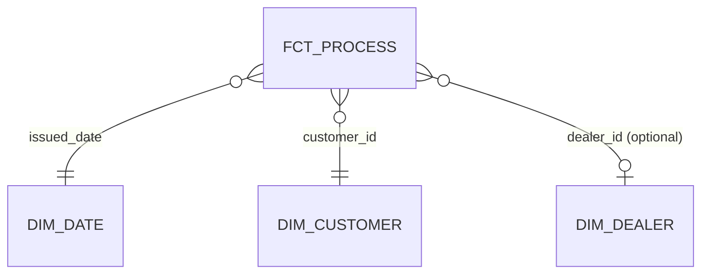

# Star Schema Spec — <business process>

One spec per business process. Sits between the
[data model canvas](data-model-canvas.md) (subject area, conceptual/logical) and the
[model blueprints](model-blueprint.md) (one per physical model).

Follow Kimball's four steps in order. Step 2 before step 4 is not negotiable — choosing
measures before declaring the grain produces a table whose grain is "whatever the join
happened to produce".

| Field | Value |
|---|---|
| Business process | a verb the business performs and measures |
| Canvas | `<subject-area>` canvas |
| Use case | `use-cases/<slug>/use-case-spec.md` |
| Owner (dbt group) | |
| Status | draft / reviewed / approved |

---

## Step 1 — the business process

> `<Verb phrase>` — e.g. "a valuation is issued", "an order is placed".

| Question | Answer |
|---|---|
| What system records it? | |
| How often does it happen? | |
| What triggers a row? | |
| What can change **after** the row is created? | nothing / milestones / measures — this decides the fact type |

If the last row is "nothing", it is a transaction fact. If milestones fill in over time,
it is an accumulating snapshot and needs `merge`.

## Step 2 — the grain

> One row per `<entity>` per `<period>` per `<qualifier>`.

| Item | Value |
|---|---|
| Fact table | `fct_<process>` |
| Fact type | transaction / periodic snapshot / accumulating snapshot / factless |
| Primary key | |
| Surrogate key needed? | `{{ dbt_utils.generate_surrogate_key([<grain cols>]) }}` |
| Expected rows at launch | |
| Growth per period | |

**Grain pressure test** — the same words describe different grains, so answer explicitly:

| Question | Answer |
|---|---|
| One row per order, or per order per status change? | |
| Does a correction update the row or add one? | |
| Does a cancelled/reversed event get a row? | |
| Can two rows share the primary key under any circumstance? | must be no |

## Step 3 — dimensions

Everything the business says "by" about. Each is a foreign key on the fact.

| Dimension | Model | FK column on fact | Conformed? | Optional? | Unknown member | SCD type |
|---|---|---|---|---|---|---|
| Date | `dim_date` | `<verb>ed_date` | yes | no | n/a | 0 |
| | `dim_<x>` | `<x>_id` | yes / new | yes / no | `-1` row / n/a | 1 / 2 / 3 / 6 |

**Optional** means the FK can be absent. Every optional FK needs an unknown member row in
the dimension — a null FK drops rows from every `inner join` a consumer writes.

**Degenerate dimensions** — transaction identifiers with no attributes of their own. These
stay **on the fact**; do not build a dimension with one column.

| Degenerate dimension | Column on fact |
|---|---|

**New dimensions this process introduces** — each needs its own blueprint, and adding it
to the [bus matrix](bus-matrix.md) is what makes it conformed rather than local:

| Dimension | Grain | Key | Will other processes use it? |
|---|---|---|---|

## Step 4 — measures

Numeric, and **true at the declared grain**. A measure true at a coarser grain will be
double-counted; it belongs in a different fact.

| Measure | Type | Additivity | Not summable across | Source | Formula |
|---|---|---|---|---|---|
| | amount / count / duration / ratio | additive / semi-additive / non-additive | — / time / everything | | |

**Grain check** — for each measure, confirm it is true at the grain in step 2:

| Measure | True at the grain? | If no, where does it belong |
|---|---|---|

Include a `1 as <process>_count` literal if the business counts occurrences — it makes
"number of X" an additive `sum()` rather than a `count()`, which is what makes it
composable in rollups and in the semantic layer.

**Non-additive measures** (ratios, averages, percentages) are **not** stored as computed
columns that consumers might sum. Store the numerator and denominator; define the ratio as
a metric in the semantic layer.

| Ratio wanted | Numerator column | Denominator column | Metric name |
|---|---|---|---|

## Star diagram

## Physical decisions

| Item | Value | Reason |
|---|---|---|
| Materialization | view / table / incremental | measured, not guessed |
| Incremental strategy | merge / insert_overwrite / append / microbatch | |
| `unique_key` | | required for merge and delete+insert |
| Lookback window | | sized to measured late-arriving data, anchored to `max()` in `{{ this }}` |
| `on_schema_change` | `append_new_columns` | |
| Partition / cluster / sort | | the column most filters use |
| Contract enforced? | yes / no | yes if any consumer is outside this project |

## Tests

| Object | Test | Why |
|---|---|---|
| fact PK | `unique` + `not_null` | enforces the declared grain |
| each FK | `relationships` to its dimension | catches orphaned facts |
| each FK | `not_null` (or documented unknown member) | null FK drops rows downstream |
| closed-domain columns | `accepted_values` | |
| each measure | `dbt_utils.accepted_range` | negatives, impossible magnitudes |
| fan-out guard | unit test: one parent with N children → one row | the most common silent doubling |
| aggregate reconciliation | singular test: `agg_` total = fact total | if an `agg_` table exists |

## Semantic layer

| Item | Value |
|---|---|
| Semantic model | `<fct_process>` |
| `primary_entity` | |
| `defaults.agg_time_dimension` | |
| Measures exposed | |
| Metrics defined | |

Every time dimension needs an explicit `time_granularity` — its absence is the single most
common MetricFlow validation failure.

## Impact

| Item | Value |
|---|---|
| New dimensions added to the bus matrix | |
| Existing dimensions reused | |
| Conformance conflicts raised | |
| Downstream consumers | |
| Blast radius checked | `python scripts/model_dependency_analyzer.py --manifest target/manifest.json --model <fct> --direction down` |

---

## Pre-build checklist

- [ ] Exactly one business process.
- [ ] Grain is one sentence and survived the pressure test.
- [ ] Every measure is true at that grain.
- [ ] Additivity recorded for every measure; ratios are metrics, not stored columns.
- [ ] Every dimension is on the bus matrix, with one key and one owner.
- [ ] Optional FKs have an unknown member.
- [ ] Degenerate dimensions stayed on the fact.
- [ ] SCD type chosen per dimension.
- [ ] Materialization decided with a measured reason.
- [ ] Fan-out guard unit test planned.
- [ ] One model blueprint written per table this spec produces.
