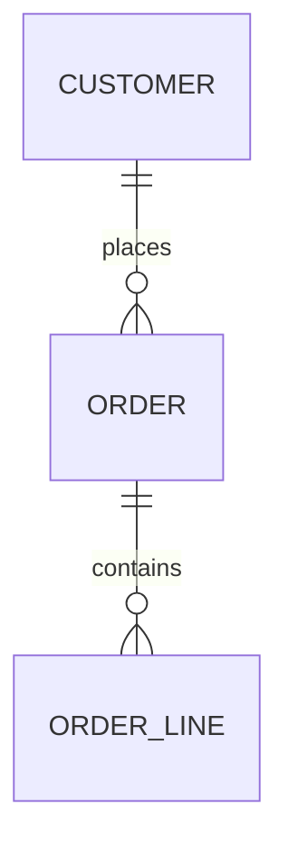

# Data Model Canvas — Order Revenue

Filled in **after** [use-case-spec.md](use-case-spec.md) and **before** the first model
blueprint. Every row in section 6 became a model in
[dbt_project/models/](dbt_project/models/) — run `./run_local.sh` and compare.

| Field | Value |
|---|---|
| Subject area | Order revenue |
| Use case(s) | [use-case-spec.md](use-case-spec.md) |
| Author / owner | Finance Analytics |
| Date | 2026-07-14 |
| Status | approved |
| Paradigm | Kimball star. One BI consumer, one business process, metric-by-dimension questions. No constraint present that would justify a normalized core or a vault. |

---

## 1. Entities

| Entity | What it is, in business words | Source of truth | Becomes |
|---|---|---|---|
| Customer | A person or company with a Shopify account. Guest checkouts have no customer. | `shopify.customers` | `dim_customers` + `customers_snapshot` |
| Order | A purchase transaction placed on the storefront. | `shopify.orders` | `fct_orders` |
| Order line | A product and quantity within an order. | `shopify.order_lines` | *not a table* — collapsed to the order grain in `int_orders_with_line_totals` |

**Rejected candidates**

| Candidate | Why it is not an entity |
|---|---|
| Product | Nobody asks for revenue by product yet. Would be a `dim_products` the day they do — noted, not built. Every dimension costs a join forever. |
| Region | Attribute of Customer, derived by a mapping. No independent lifecycle. |
| Payment status | Attribute of Order. Closed domain, so it is a column with `accepted_values`, not a junk dimension — five values on a 500-row fact is not worth a join. |
| Currency | Single value (`USD`) today. A column, not a dimension, until a second currency exists. |

## 2. Events (business processes)

| Event | Grain — one sentence | Frequency | Becomes |
|---|---|---|---|
| Order placed | One row per order, at its current status | ~500/day | `fct_orders` |

One process, so **no bus matrix** — see [bus-matrix.md](../../templates/bus-matrix.md) for
when one is needed. A second process (fulfilment, refunds) would need one before it is
built, to confirm `dim_customers` conforms rather than getting copied.

## 3. ERD

| Relationship | Cardinality | Optional side | What the optionality means in practice |
|---|---|---|---|
| Customer → Order | 1:N | `order.customer_id` nullable | Guest checkout, ~3% of orders. `left join`, never `inner` — an inner join silently drops 3% of revenue. |
| Order → Order line | 1:N | lines optional | ~0.3% of orders have no line items (upstream defect). Aggregate then `left join`, `coalesce` to zero — not null, and not dropped. |

No many-to-many. No bridge table.

## 4. Keys

| Entity | Business key | Stable? | Surrogate key | Why a surrogate |
|---|---|---|---|---|
| Customer | `id` | yes | none | Single column, stable, not PII |
| Order | `id` | yes | none | Single column, stable |
| Order line | `id` | yes | none | Never surfaces as a table |

No surrogate keys in this model. Worth stating explicitly: a hashed key here would add a
column nobody joins on.

## 5. Attributes

### Customer

| Attribute | Type | Source | Nullable | SCD type | Notes |
|---|---|---|---|---|---|
| `customer_id` | varchar | `customers.id` | no | 0 | PK |
| `customer_email` | varchar | `customers.email` | no | 1 | **PII** — masked outside prod |
| `country_code` | varchar | `customers.country_code` | yes | **2** | Mutable; overwrites in place upstream |
| `region` | varchar | derived | no | 1 | Finance-owned mapping; unmapped → `OTHER`, never null |
| `first_seen_at` | timestamp | `customers.created_at` | no | 0 | |

`country_code` is the only Type 2 attribute, which is why `customers_snapshot` exists.
`dim_customers` itself is Type 1 — see section 7.

### Order

| Attribute | Type | Source | Nullable | SCD type | Notes |
|---|---|---|---|---|---|
| `order_id` | varchar | `orders.id` | no | 0 | PK |
| `customer_id` | varchar | `orders.customer_id` | **yes** | 0 | Guest checkout |
| `order_status` | varchar | derived from `financial_status` | no | 1 | Closed domain; refund overrides fulfilment |
| `ordered_at` | timestamp | `orders.created_at` | no | 0 | |

**Attributes with a contested definition**

| Attribute | Team A says | Team B says | Decision | Decided by |
|---|---|---|---|---|
| `order_status` for a fulfilled-then-refunded order | Ops: `fulfilled` — it shipped | Finance: `refunded` — we gave the money back | `refunded`. This mart answers "what did we keep". Ops gets their own view off the same fact. | Finance Analytics, 2026-07-11 |

## 6. Grain matrix

| Model | One row per | Primary key | Expected rows | Growth |
|---|---|---|---|---|
| `stg_shopify__orders` | order, incl. test orders | `order_id` | ~1.4M | ~500/day |
| `stg_shopify__order_lines` | order line | `order_line_id` | ~3.4M | ~1,200/day |
| `stg_shopify__customers` | customer, current state | `customer_id` | ~180k | ~120/day |
| `int_orders_with_line_totals` | non-test order, line totals collapsed | `order_id` | ~1.4M | ~500/day |
| `dim_customers` | customer, current state | `customer_id` | ~180k | ~120/day |
| `fct_orders` | order at its current status | `order_id` | ~1.4M | ~500/day |
| `customers_snapshot` | customer **per version** | `(customer_id, dbt_valid_from)` | grows with changes | ~5/day |
| `metricflow_time_spine` | calendar day | `date_day` | ~3,300 | fixed |

## 7. History requirements

| Entity/attribute | History matters? | Why | SCD type | Mechanism |
|---|---|---|---|---|
| Customer `country_code` | yes | "Revenue by the region the customer was in **when they ordered**" is a real finance question | 2 | `customers_snapshot`, `check` strategy on the raw source |
| Customer `customer_email` | no | Corrections only | 1 | overwrite in `dim_customers` |
| Order status | no | Only current status is reported | 1 | `fct_orders` incremental `unique_key` overwrite |

`dim_customers` is deliberately **Type 1**, with `customers_snapshot` alongside it for the
as-was question. Making the dimension itself Type 2 would force a date predicate onto
every consumer for one attribute — and most of them would forget it.

## 8. Additivity

| Measure | Fact | Additivity | Not summable across | Semantic layer metric |
|---|---|---|---|---|
| `order_amount_usd` | `fct_orders` | additive | — | `revenue` |
| `net_line_amount_usd` | `fct_orders` | additive | — | — |
| `line_item_count` | `fct_orders` | additive | — | — |
| order count | `fct_orders` | additive | — | `order_count` |
| average order value | — | **non-additive** | everything | `average_order_value` — a ratio metric, **not** a stored column |

Average order value is the reason the ratio is a metric: stored as a column it would be
averaged-of-averages by any BI tool that grouped it.

## 9. Conformance

| Dimension | Used by processes | Single definition agreed? | Owner |
|---|---|---|---|
| `dim_customers` | Order placed (only) | n/a — one process today | Finance Analytics |

**Open risk.** `dim_customers` lives in `models/marts/finance/`. The moment a second
domain uses it, it must move to a shared `core/` domain — otherwise the second team copies
it. `dimensional_model_validator.py` flags this as `dimension_not_shared_domain` as soon
as a second domain's fact references it.

## 10. Open questions

| # | Question | Blocks | Owner | Status |
|---|---|---|---|---|
| 1 | `[NEEDS INPUT]` NetSuite `loaded_at_field` — no column identified | NetSuite source freshness | Data Engineering | open |
| 2 | Does Finance want product-level revenue in the next two quarters? | Whether `dim_products` and an order-line-grain fact get built | Finance Analytics | open |

## 11. Decisions log

| Date | Decision | Alternative rejected | Because |
|---|---|---|---|
| 2026-07-11 | Refund overrides fulfilment in `order_status` | Report both statuses in separate columns | Two status columns means every consumer picks one, and they pick differently |
| 2026-07-12 | `dim_customers` is SCD1 + a separate SCD2 snapshot | SCD2 on the dimension itself | One volatile attribute among five; SCD2 would force a date predicate on every query |
| 2026-07-12 | No `dim_products` | Build it now, "we'll need it" | Nobody asks revenue by product. Every dimension costs a join forever |
| 2026-07-14 | `region` denormalized onto `fct_orders` as **as-is** | as-was via snapshot join | Finance reports on where a customer is now. As-was is available via `customers_snapshot` for anyone who needs it |

---

## Review checklist

- [x] Every entity passed both entity tests; rejected candidates are recorded.
- [x] Every relationship has explicit cardinality **and** optionality.
- [x] No many-to-many to resolve.
- [x] Every entity has a key; no key hashes a mutable attribute.
- [x] Every model in the grain matrix has a one-sentence grain and a primary key.
- [x] SCD type chosen per entity — chosen, not defaulted.
- [x] Additivity recorded for every measure.
- [x] Conformance risk recorded even though there is one process today.
- [x] Contested definition resolved by a named person.
- [x] Open questions have owners.
