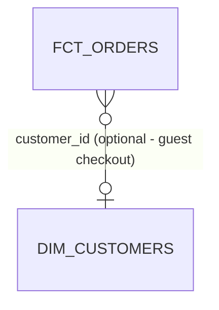

# Star Schema Spec — Order Placed

The one business process in this subject area. Sits between
[data-model-canvas.md](data-model-canvas.md) and the model blueprints. Every decision here
is visible in [dbt_project/models/marts/finance/](dbt_project/models/marts/finance/).

| Field | Value |
|---|---|
| Business process | An order is placed |
| Canvas | [data-model-canvas.md](data-model-canvas.md) |
| Use case | [use-case-spec.md](use-case-spec.md) |
| Owner (dbt group) | `finance` |
| Status | approved |

---

## Step 1 — the business process

> **An order is placed** on the Shopify storefront.

| Question | Answer |
|---|---|
| What system records it? | Shopify, landed by Fivetran into `raw.shopify` |
| How often? | ~500/day |
| What triggers a row? | Checkout completion, including guest checkout |
| What can change **after** the row is created? | `financial_status` — an order can be paid, then fulfilled, then refunded |

The last answer decides the fact type. Rows change after creation, but only one attribute
does and only current state is reported — so a **transaction fact with an upsert**, not an
accumulating snapshot. An accumulating snapshot would be right if finance asked
"how long from paid to fulfilled", and that is the change that would force a redesign.

## Step 2 — the grain

> **One row per order, at its current status.**

| Item | Value |
|---|---|
| Fact table | `fct_orders` |
| Fact type | transaction |
| Primary key | `order_id` |
| Surrogate key needed? | no — single stable business key |
| Expected rows at launch | ~1.4M |
| Growth | ~500/day |

**Grain pressure test** — the same words describe different grains, so answer explicitly:

| Question | Answer |
|---|---|
| One row per order, or per order per status change? | **Per order.** Status history is not reported. If it were, the grain would be one row per order per status change and this whole spec changes. |
| Does a correction update the row or add one? | Updates — hence `unique_key: order_id` and an upsert strategy. |
| Does a cancelled order get a row? | Yes, with `order_status = 'cancelled'`. Excluding it would make order counts disagree with Shopify's. |
| Do test orders get a row? | **No** — filtered in intermediate, not staging, because a QA model legitimately needs them. |
| Can two rows share the PK? | No. `unique` + `not_null` on `order_id` enforces it. |

## Step 3 — dimensions

| Dimension | Model | FK column on fact | Conformed? | Optional? | Unknown member | SCD type |
|---|---|---|---|---|---|---|
| Date | *none built* | `ordered_date` | n/a | no | n/a | 0 |
| Customer | `dim_customers` | `customer_id` | one process today | **yes** | none — see below | 1 (+ SCD2 snapshot) |

**No `dim_date`.** `ordered_date` is a plain date column on the fact. A date dimension
earns its place when there is a fiscal calendar, holiday flags, or week-numbering conventions the
warehouse's date functions cannot express — none of which finance has asked for. The
MetricFlow time spine covers cumulative metrics.

**The optional FK, and the decision not to add an unknown member.** ~3% of orders are
guest checkouts with a null `customer_id`. The textbook answer is a `-1` unknown-member
row in `dim_customers` with `coalesce(customer_id, '-1')` on the fact. That was
**rejected**: it would put a fake customer in a dimension that Finance also uses for
customer counts, and someone would eventually count it. Instead:

- `customer_id` is nullable and documented as such;
- the `relationships` test is scoped `where: "customer_id is not null"`;
- every consumer is told to `left join`, and `region` is null for those rows.

`dimensional_model_validator.py` still reports `nullable_fk_no_unknown_member` on this
column. That is correct behaviour — it is a real risk, consciously accepted, and this
paragraph is the record of that decision.

**Degenerate dimensions:** none. `currency_code` is dropped at the mart because there is
one currency; it returns as a real column if that changes.

## Step 4 — measures

| Measure | Type | Additivity | Not summable across | Source | Formula |
|---|---|---|---|---|---|
| `order_amount_usd` | amount | additive | — | `orders.total_price` | passthrough, cast |
| `net_line_amount_usd` | amount | additive | — | line aggregate | `gross_line_amount - discount_amount` |
| `line_item_count` | count | additive | — | line aggregate | `count(*)` per order |

**Grain check** — each measure against "one row per order":

| Measure | True at the grain? | Note |
|---|---|---|
| `order_amount_usd` | yes | one value per order |
| `net_line_amount_usd` | yes | lines are aggregated to the order **before** the join |
| `line_item_count` | yes | same aggregate |
| ~~customer lifetime value~~ | **no** | true at customer grain; would be summed once per order. Belongs on `dim_customers` or its own fact. Not built. |

The last row is the mixed-grain trap. `dimensional_model_validator.py` would flag
`customer_lifetime_value` on this fact as `foreign_entity_measure`.

**Non-additive measures**

| Ratio wanted | Numerator | Denominator | Metric name |
|---|---|---|---|
| Average order value | `order_total` | `order_count` | `average_order_value` (ratio metric) |

Stored as a column, a BI tool would average the averages. Defined as a ratio metric, it is
computed correctly at whatever grain the user groups by.

## Star diagram

Matches what [erd_generator.py](../../../../scripts/erd_generator.py) produces from the built
manifest — the `o|` on the right is the optionality, derived from the absent `not_null`
test rather than from intent.

## Physical decisions

| Item | Value | Reason |
|---|---|---|
| Materialization | `incremental` | Full refresh measured at 14 min / 1.4M rows; daily rebuild is not worth it |
| Incremental strategy | `incremental_upsert_strategy()` | `merge` where supported, `delete+insert` on DuckDB/Postgres. **Not hardcoded** — the failure would only appear on the second run |
| `unique_key` | `order_id` | Required for upsert; status changes overwrite |
| Lookback window | 3 days | Measured p99 arrival lag 38h, doubled. Anchored to `max(ordered_at)` in `{{ this }}`, **not** `current_date` — a skipped run must not leave a permanent hole |
| `on_schema_change` | `append_new_columns` | A new upstream column should not silently vanish |
| Partition / cluster | `cluster_config(['ordered_date'])` | Snowflake clusters, BigQuery partitions, DuckDB does neither |
| Contract enforced? | **yes** | `access: public`, consumed by a BI dashboard outside this project |

The contract is why every aggregate is explicitly cast: `count(*)` is `BIGINT` on DuckDB
and `INT64` on BigQuery, and a contract compares exact types.

## Tests

| Object | Test | Status |
|---|---|---|
| `order_id` | `unique` + `not_null` | built |
| `customer_id` | `relationships` to `dim_customers`, scoped to non-null | built |
| `order_status` | `not_null` + `accepted_values` (error) | built |
| `order_status` | `accepted_values` minus `unknown` (warn) | built — fires when Shopify adds a status |
| `order_amount_usd` | `accepted_range >= 0`, severity `warn` | built — negatives occur during refund reprocessing |
| fan-out guard | unit test: one order, three lines → one row | built, `test_line_fanout_does_not_duplicate_orders` |
| region mapping | unit test: one country per CASE branch | built, `test_region_mapping_covers_each_branch` |

## Semantic layer

| Item | Value |
|---|---|
| Semantic model | `fct_orders` |
| `primary_entity` | `order` |
| `defaults.agg_time_dimension` | `ordered_at` |
| Measures | `order_total`, `order_count` |
| Metrics | `revenue`, `order_count`, `average_order_value`, `revenue_trailing_28d`, `revenue_mtd` |

---

## Pre-build checklist

- [x] Exactly one business process.
- [x] Grain is one sentence and survived the pressure test.
- [x] Every measure is true at that grain; the one that was not is recorded and not built.
- [x] Additivity recorded; the ratio is a metric, not a column.
- [x] Optional FK decision made explicitly, with the rejected alternative recorded.
- [x] Degenerate dimensions considered — none apply.
- [x] SCD type chosen per dimension.
- [x] Materialization decided from a **measured** full-refresh cost.
- [x] Fan-out guard unit test built.
